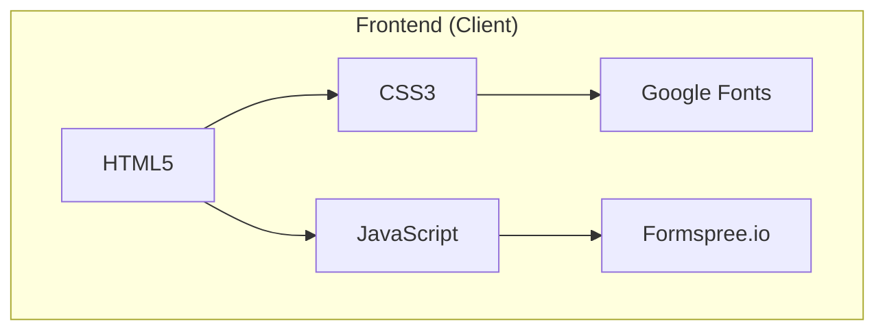
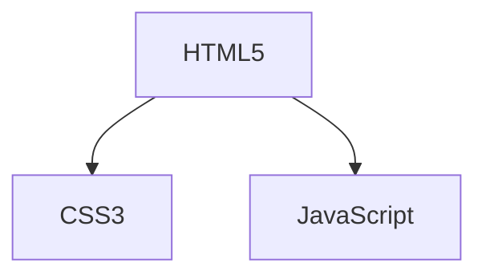

# 📊 Schémas Mermaid - Site L'Atelier de Lizzy

Ce dossier contient les schémas descriptifs du projet au format Mermaid, utilisables pour la documentation technique.

## 📁 Fichiers Disponibles

### 1. [architecture.mmd](architecture.mmd)
**Description :** Schémas d'architecture globale du projet

**Contenu :**
- Schéma global de l'architecture (Frontend, Structure, Configuration, Hébergement)
- Structure des pages et leurs relations
- Flux utilisateur typique
- Composants UI et leurs relations (diagramme de classes)
- Breakpoints responsive design
- Dépendances externes (CDN, Services, Réseaux Sociaux)

**Utilisation :**


---

### 2. [structure-detailed.mmd](structure-detailed.mmd)
**Description :** Schémas détaillés de la structure interne

**Contenu :**
- Arbre complet des fichiers du projet
- Structure HTML typique avec hiérarchie détaillée
- Organisation CSS avec variables et sections
- Architecture JavaScript avec fonctions et dépendances
- Structure SEO et metadata
- Gestion des images et mécanismes de fallback

**Utilisation :**
```mermaid
flowchart TD
    root[/workspace/drch13__site-lizzy/] --> index.html
    root --> a-propos.html
    root --> css/
    css --> style.css
```

---

## 🎯 Comment Utiliser Ces Schémas

### 1. Visualisation en Local

#### Avec VS Code
1. Installer l'extension **Mermaid Preview** ou **Markdown Preview Mermaid Support**
2. Ouvrir un fichier `.mmd`
3. Appuyer sur `Ctrl+Shift+V` pour prévisualiser

#### Avec Mermaid CLI
```bash
# Installer mermaid-cli
npm install -g @mermaid-js/mermaid-cli

# Générer un SVG
mmdc -i architecture.mmd -o architecture.svg
```

#### Avec Mermaid Live Editor
1. Aller sur [https://mermaid.live/](https://mermaid.live/)
2. Copier-coller le contenu d'un fichier `.mmd`
3. Visualiser et exporter

### 2. Intégration dans la Documentation

Vous pouvez intégrer ces schémas directement dans votre documentation Markdown :

```markdown
## Architecture du Projet


```

### 3. Génération Automatique

Pour générer tous les SVG à partir des fichiers Mermaid :

```bash
#!/bin/bash
for file in *.mmd; do
    filename=$(basename "$file" .mmd)
    mmdc -i "$file" -o "${filename}.svg"
done
```

---

## 📊 Légende des Couleurs

Dans les schémas, les couleurs ont une signification :

| Couleur | Signification |
|---------|---------------|
| `#e1f5fe` (Bleu clair) | Frontend / Client |
| `#c8e6c9` (Vert clair) | Hébergement / Infrastructure |
| `#ffcccc` (Rouge clair) | Éléments manquants / Problèmes |
| `#fff3cd` (Jaune clair) | Avertissements |
| `#d1ecf1` (Cyan clair) | Services externes |

---

## 🔄 Mise à Jour

Pour mettre à jour ces schémas :

1. Modifier les fichiers `.mmd` avec un éditeur de texte
2. Vérifier la syntaxe avec [Mermaid Live Editor](https://mermaid.live/)
3. Générer les SVG si nécessaire
4. Commiter les changements

---

## 📚 Ressources Mermaid

- **Documentation Officielle :** [https://mermaid.js.org/](https://mermaid.js.org/)
- **Tutoriel :** [https://mermaid.js.org/intro/tutorial.html](https://mermaid.js.org/intro/tutorial.html)
- **Exemples :** [https://mermaid.js.org/intro/examples.html](https://mermaid.js.org/intro/examples.html)
- **Live Editor :** [https://mermaid.live/](https://mermaid.live/)

---

## 🎨 Types de Diagrammes Utilisés

| Type | Description | Exemple |
|------|-------------|---------|
| `flowchart` | Diagramme de flux | `flowchart TD` |
| `journey` | Parcours utilisateur | `journey` |
| `classDiagram` | Diagramme de classes | `classDiagram` |
| `stateDiagram` | Diagramme d'état | `stateDiagram` |

---

**Note :** Tous les schémas sont conçus pour être auto-documentés et faciles à comprendre. Ils suivent les conventions Mermaid standard.
